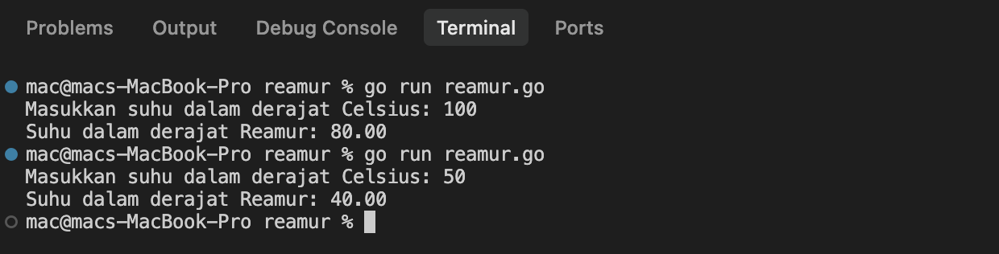

# <h1 align="center">Laporan Praktikum Modul 03 - Tipe Data dan Instruksi Dasar</h1>
<p align="center">Raihan Ahmad Rahmadhani - [109092600025]</p>

## Dasar Teori

### A. Variabel dan Tipe Data di Go
Di bahasa Go, setiap variabel memiliki tipe data yang ketat (*strongly typed*). Beberapa tipe data dasar yang sering dipakai antara lain:
- **`int`**: Untuk bilangan bulat (misal: jumlah barang, skor).
- **`float64`**: Untuk bilangan desimal atau pecahan (misal: suhu, jari-jari lingkaran).
- **`string`**: Untuk teks/karakter (misal: nama).

Deklarasi variabel bisa ditulis eksplisit dengan `var namaVariabel tipeData` atau menggunakan *short declaration* `:=` jika nilainya langsung diisi pada saat pembuatan variabel.

### B. Input dan Output (I/O)
1. **Input (`fmt.Scan`)**: Mengambil masukan dari keyboard. Di Go, kita perlu menambahkan simbol `&` di depan variabel (seperti `fmt.Scan(&a)`) agar nilai masukan langsung disimpan ke alamat memori variabel tersebut.
2. **Output (`fmt.Println` & `fmt.Printf`)**: `fmt.Println` digunakan untuk mencetak teks biasa dengan baris baru otomatis, sedangkan `fmt.Printf` dipakai saat kita butuh format khusus menggunakan format *specifier* seperti `%d` (integer) atau `%f` / `%.2f` (desimal).

### C. Operator Aritmatika
Go mendukung operator aritmatika standar seperti penjumlahan (`+`), pengurangan (`-`), perkalian (`*`), pembagian (`/`), dan modulus (`%`). Yang perlu diperhatikan adalah operasi pembagian pada tipe `int` akan menghasilkan bilangan bulat (sisa desimal dibuang), sedangkan pada tipe `float64` hasilnya berupa bilangan pecahan. Operator modulus (`%`) hanya bisa digunakan pada tipe `int` dan berguna untuk mengambil sisa hasil bagi, misalnya untuk memecah satuan waktu atau uang.

### D. Konversi Satuan
Konversi satuan adalah proses mengubah nilai dari satu satuan ke satuan lain menggunakan rumus matematika tertentu. Contohnya konversi suhu dari Celsius ke Kelvin (tambah 273) atau dari Celsius ke Réaumur (kalikan 4/5). Dalam pemrograman, proses ini cukup ditulis sebagai ekspresi matematika biasa.

## Guided

### 1. konversi.go

```go
package main

import "fmt"

func main() {
	var celcius float64

	fmt.Print("Masukan suhu celcius: ")
	fmt.Scanln(&celcius)

	fmt.Print("Suhu dalam kelvin: ")
	fmt.Println(celcius + 273)

}
```
#### Deskripsi
Program ini menerima input berupa nilai suhu dalam satuan Celsius bertipe `float64`, kemudian mengkonversinya ke satuan Kelvin menggunakan rumus `celsius + 273`. Hasilnya langsung dicetak ke layar menggunakan `fmt.Println`. Program ini merupakan contoh sederhana penggunaan variabel bertipe `float64` dan operasi penjumlahan dasar.

### 2. tukar.go

```go
package main

import "fmt"

func main() {
	var x, y, z int
	fmt.Scanln(&x, &y, &z)

	temp := x
	x = z
	z = y
	y = temp

	fmt.Println(x, y, z)
}
```
#### Deskripsi
Program ini membaca tiga nilai integer `x`, `y`, dan `z` dari input pengguna, kemudian melakukan pertukaran nilai secara berantai (rotasi). Prosesnya menggunakan variabel sementara `temp` untuk menyimpan nilai `x` sebelum digeser. Urutan pertukaran: `x` diisi dari `z`, `z` diisi dari `y`, dan `y` diisi dari `temp` (nilai `x` awal). Hasil akhirnya dicetak menggunakan `fmt.Println`.

### 3. kasir.go

```go
package main

import "fmt"

func main() {
	var uang int

	fmt.Println("=== Program Pemecah Pecahan Uang ===")
	fmt.Print("Masukkan nominal uang: ")
	fmt.Scan(&uang)

	totalAwal := uang

	sepuluhRibu := uang / 10000
	uang = uang % 10000

	limaRibu := uang / 5000
	uang = uang % 5000

	seribu := uang / 1000

	fmt.Printf("\nHasil Pemecahan Uang Rp %d:\n", totalAwal)
	fmt.Printf("- Pecahan 10.000 : %d lembar\n", sepuluhRibu)
	fmt.Printf("- Pecahan 5.000  : %d lembar\n", limaRibu)
	fmt.Printf("- Pecahan 1.000  : %d lembar\n", seribu)
}
```
#### Deskripsi
Program ini memecah nominal uang yang diinputkan pengguna ke dalam pecahan 10.000, 5.000, dan 1.000 rupiah. Logikanya menggunakan pembagian integer (`/`) untuk menghitung jumlah lembar pada pecahan terbesar terlebih dahulu, lalu operator modulus (`%`) untuk mengambil sisa uang yang belum terpecah dan dilanjutkan ke pecahan berikutnya. Nilai awal disimpan di variabel `totalAwal` agar tetap bisa ditampilkan di output meskipun variabel `uang` sudah dimodifikasi selama proses pemecahan.

## Unguided

### 1. reamur.go

```go
package main

import "fmt"

func main() {
	var celsius float64

	fmt.Print("Masukkan suhu dalam derajat Celsius: ")
	fmt.Scan(&celsius)

	reamur := (4.0 / 5.0) * celsius

	fmt.Printf("Suhu dalam derajat Reamur: %.2f\n", reamur)
}
```

##### Output


#### Deskripsi
Program ini mengkonversi suhu dari satuan Celsius ke Réaumur. Pengguna memasukkan nilai suhu bertipe `float64`, lalu program menghitung hasilnya menggunakan rumus `°Ré = (4/5) × °C`. Agar pembagian tidak dibulatkan menjadi bilangan bulat, angka yang digunakan ditulis sebagai `4.0 / 5.0` sehingga Go memperlakukannya sebagai operasi `float64`. Hasil akhir dicetak dengan dua angka desimal menggunakan format `%.2f`.

### 2. jumlah_hari.go

```go
package main

import "fmt"

func main() {
	var hari int

	fmt.Print("Masukkan jumlah hari: ")
	fmt.Scan(&hari)

	tahun := hari / 360
	hari = hari % 360

	bulan := hari / 30
	hari = hari % 30

	minggu := hari / 7
	sisaHari := hari % 7

	fmt.Printf("Tahun  : %d\n", tahun)
	fmt.Printf("Bulan  : %d\n", bulan)
	fmt.Printf("Minggu : %d\n", minggu)
	fmt.Printf("Hari   : %d\n", sisaHari)
}
```

##### Output


#### Deskripsi
Program ini mengkonversi jumlah hari yang diinputkan menjadi satuan yang lebih besar: tahun, bulan, minggu, dan sisa hari. Pendekatannya mirip dengan program kasir, yaitu menggunakan pembagian integer (`/`) untuk mendapatkan satuan terbesar, lalu modulus (`%`) untuk mengambil sisa yang akan diproses ke satuan berikutnya. Dalam program ini diasumsikan 1 tahun = 360 hari dan 1 bulan = 30 hari. Hasilnya ditampilkan rapi baris per baris menggunakan `fmt.Printf`.

## Kesimpulan
Pada praktikum Modul 03 ini, saya mempelajari cara mendeklarasikan variabel dengan tipe data yang sesuai (`int` untuk bilangan bulat dan `float64` untuk bilangan desimal), serta cara melakukan input dan output menggunakan fungsi dari paket `fmt`. Hal penting yang saya pelajari adalah penggunaan simbol `&` saat `fmt.Scan` agar nilai dari keyboard bisa langsung tersimpan ke variabel, serta perbedaan perilaku pembagian pada tipe `int` vs `float64`. Selain itu, saya juga memahami cara memanfaatkan operator modulus (`%`) untuk memecah suatu nilai ke dalam satuan-satuan yang lebih kecil secara bertahap, seperti yang diterapkan pada program kasir dan konversi jumlah hari.
