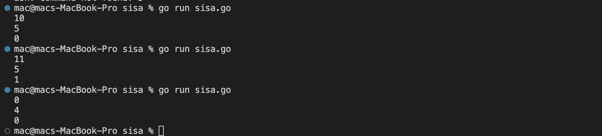
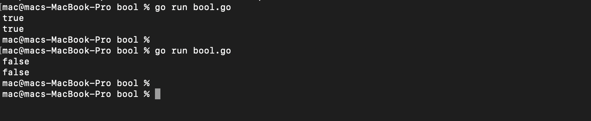
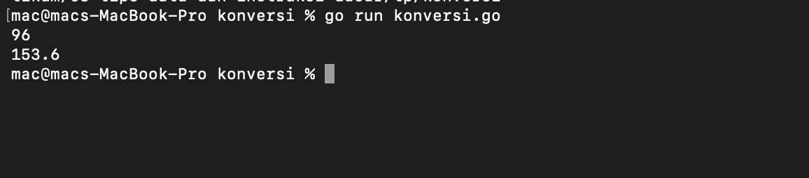

# <h1 align="center">Tugas Pendahuluan Modul [003] - [tipe data dan instruksi dasar]</h1>
<p align="center">[Raihan Ahmad Rahmadhani] - [109092600025]</p>

### 1. Sisa Kue
```go
package main

import "fmt"

func main() {
	var x, y int
	fmt.Scan(&y, &x)
	fmt.Println(y % x)
}
```

##### Output




#### Deskripsi
Pada program ini, saya membuat program untuk menghitung berapa sisa kue yang tidak habis dibagikan ke anggota keluarga. Saya membuat dua variabel `x` dan `y` bertipe `int`, di mana `y` adalah jumlah kue dan `x` adalah jumlah anggota keluarga. Input dibaca sekaligus menggunakan `fmt.Scan(&y, &x)`. Untuk mencari sisa kue yang tidak terbagi rata, saya memakai operator modulo (`%`) yaitu `y % x`, lalu hasilnya langsung ditampilkan ke layar dengan `fmt.Println`.

### 2. bool

```go
package main

import "fmt"

func main() {
	var b bool
	fmt.Scan(&b)
	fmt.Println(b)
}

```

##### Output




#### Deskripsi
Di soal kedua ini, tugasnya adalah membaca dan mencetak kembali nilai boolean. Di sini saya mendeklarasikan variabel `b` dengan tipe data `bool`. Program kemudian membaca input dari user (`true` atau `false`) lewat perintah `fmt.Scan(&b)`, setelah itu nilainya langsung dicetak kembali ke terminal menggunakan `fmt.Println(b)`.

### 3. konversi

```go
package main

import "fmt"

func main() {
	var mil float64
	fmt.Scan(&mil)
	km := mil * 1.6
	fmt.Printf("%.1f\n", km)
}
```

##### Output




#### Deskripsi
Di program ketiga ini, saya membuat program untuk mengonversi jarak mil ke kilometer dengan rumus 1 mil = 1.6 km. Karena input jarak berupa angka desimal, saya menggunakan variabel `mil` dengan tipe data `float64`. Setelah nilai mil diinput lewat `fmt.Scan(&mil)`, nilainya dikalikan dengan `1.6` dan disimpan ke variabel `km`. Terakhir, hasilnya dicetak menggunakan `fmt.Printf("%.1f\n", km)` supaya tampilannya rapi dan hanya menampilkan 1 angka di belakang koma sesuai petunjuk soal.

## Kesimpulan
Dari pengerjaan tugas pendahuluan modul 3 ini, beberapa hal yang saya pelajari dan pahami antara lain:
1. Mengetahui cara mendeklarasikan serta memilih tipe data yang sesuai di bahasa Go, seperti `int` untuk bilangan bulat, `bool` untuk nilai kebenaran (`true`/`false`), dan `float64` untuk angka pecahan atau desimal.
2. Memahami penggunaan fungsi input dan output dasar dari package `fmt`, yaitu `fmt.Scan` untuk mengambil input dari user, serta `fmt.Println` dan `fmt.Printf` (khususnya format specifier `%.1f`) untuk menampilkan output ke layar dengan rapi.
3. Belajar memanfaatkan operator aritmatika seperti perkalian (`*`) dan modulo (`%`) untuk menyelesaikan perhitungan logika sederhana di dalam kode program.
